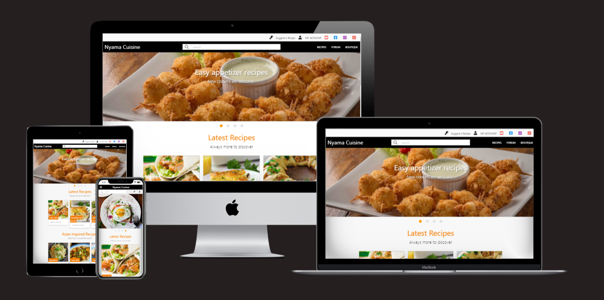
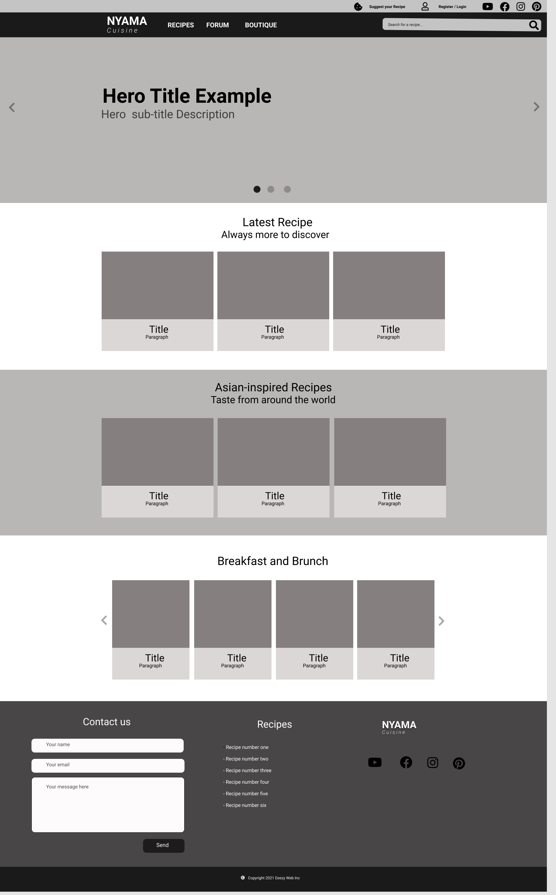
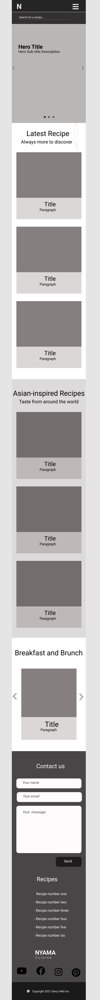

<h1 align="center">Nyama Cuisine</h1>

[Click here to view the live project.](https://nyama-cuisine-flask.herokuapp.com/)

This is a fictional cookbook website built with Flask (Python framework) and Materializecss (css responsive framework).This website is built for cooks of all backgrounds, from amateur cook to professional chef, who want to find or share recipes of their interest. Everyone is welcome to discover new kitchen tips.

<h2 align="center"></h2>

## User Experience (UX)

### User stories

*	As a first time user I want to quickly find a recipe.
*	I want to search for recipe by category or name.
*	I want to suggest a cooking recipe.
*	I want to share ideas and experience with people interested in cooking.

### Business Strategy (Owner goals)

*	Build a community of people interested in cooking.
*	Promote or sale kitchen tools, recipes ingredients.

### Design
#### Colours 
-   Orange is used as it's described as the color of adventure and attachment. Users will feel confident to share and discover recipes. Home sweet home!
#### Typography
-   Default MaterializeCss font is used as it's appealing and eye catch.
#### Imagery
-   On the main page, right after the menu bar, we have a slideshow for users to directly get connected to the website content.

### Wireframes

*   Home Page Wireframe Desktop 
    

*   Home Page Wireframe Mobile 
    

## Features

### Existing Features
#### Responsive on all device sizes with interactive elements 

#### Recipes list (by clicking on Recipes on the menu bar)
#### Recipe (by clicking on item in the Recipes list)
#### Search for a recipe by name or category for example
#### User Registration and Login
#### User Logout
#### User account
#### User Registration and Login

### Features Left to Implement
#### Forum
A place where users can hold conversations about cooking or a specific recipe
#### Boutique
A place where will be available for sale kitchen tools and ingredients from future advertisers

## Technologies Used

### Languages Used

-   HTML5
-   CSS3
-   Javascript
-   Python
-   Mongo Database

### Frameworks, Libraries & Programs Used

1. [MaterializeCss 1.0.0:](https://materializecss.com/)
    - Materialize was used to assist with the responsiveness and styling of the website.
1. [Font Awesome:](https://fontawesome.com/)
    - Font Awesome was used throughout the website to add icons for aesthetic and UX purposes.
1. [jQuery:](https://jquery.com/)
    - jQuery was used to write less Javascript and quickly active MaterializeCss Javascript functionalities.
1. [Gitpod:](https://gitpod.io/)
    - Gitpod is an online integrated development environment (IDE).
1. [GitHub:](https://github.com/)
    - GitHub is used to store the projects code after being pushed from Gitpod.
1. [Heroku:](https://www.heroku.com/)
    - Heroku is used to deploy our project.Our Heroku account is connected to our Github repo.
1. [Werkzeug](https://werkzeug.palletsprojects.com/en/1.0.x/) 
    - Werkzeug was used for generate_password_hash / check_password_hash.
1. [Randomkeygen](https://randomkeygen.com/)
    - Randomkeygen to generate passes for SECRET_KEY.
1. [FIGMA:](https://www.figma.com/)
    - FIGMA was used to create the wireframes.

## Testing

The W3C Markup Validator and W3C CSS Validator Services were used to validate every page of the project to ensure there were no syntax errors in the project.

-   [W3C Markup Validator](https://validator.w3.org/#validate_by_input) 
-   [W3C CSS Validator](https://jigsaw.w3.org/css-validator/validator.html.en#validate_by_input)
 ### Links
 Menu links, and external links were manually checked.
### Further Testing

-   Google Chrome, Firefox, Microsoft Edge and Opera browsers.
-   The website was viewed on a variety of devices such as Desktop, Laptop, iPhone7, iPhone 8 & iPhoneX.
-   A large amount of testing was done to ensure that all pages were linking correctly.

## Deployment

### Heroku Pages

The project was deployed on Heroku Pages following steps...

1. Log in to GitHub and create the [GitHub Repository](https://github.com/hervembarga/milestoneProject3-nyama-cuisine)
1. Open our GitHub repo throughout Gitpod.
1. Connect Github repo with an Heroku app(created On CLI or GUI).
1. Create a MongoDB and link it to our app throughout env.py (on Gitpod) config vars on Heroku.
1. requirement.txt need to be created as well as Procfile.
- a step by step deployment can be viewed [Here](https://www.geeksforgeeks.org/deploy-python-flask-app-on-heroku/)
## Credits

### Code

-   [W3 Schools](http://w3schools.com/)

-   [MaterializeCss](https://materializecss.com/): used throughout the project mainly to make site responsive.

-   [EmailJs Api](https://www.emailjs.com/docs/) : used for sending messages through contact form.

### Content

-   Some content was written by the developer.
-   Most content is pulled from the database.

### recipes

- Recipes are were taken from [Online Cookbook](http://online-cookbook.com/)

### Photos
-   Photos were pulled from google search

### Acknowledgements

-   My Mentor for continuous helpful feedback.
